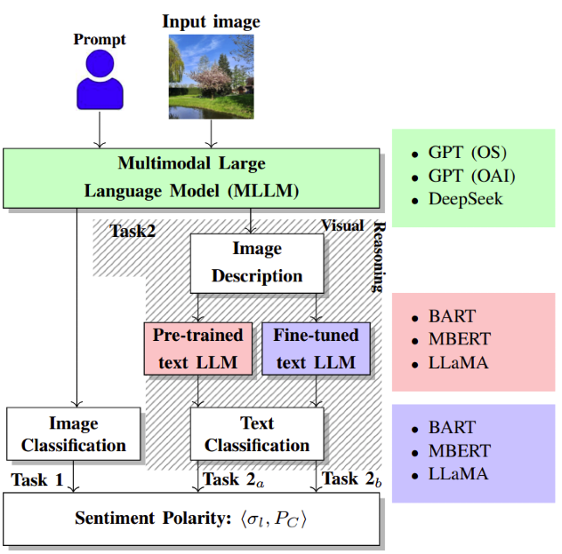

# Do Multimodal LLMs See Sentiment?


---

## Overview
<p align="center">

<h6 align="center"> Architecture diagram of MLLMsent, our proposed Multimodal Large Language Model
framework for sentiment analysis..</h6>

**MLLMsent** is a research framework for investigating sentiment reasoning in MultiModal Large Language Models (MLLMs). It provides end-to-end tools for sentiment analysis from visual content, focusing on how images communicate sentiment through complex, scene-level semantics.

- **Direct sentiment classification** from images using MLLMs
- **Sentiment analysis on MLLM-generated captions** using pre-trained LLMs (with only the final classification layer trained)
- **Full fine-tuning** of LLMs on sentiment-labeled captions

The framework supports multiple transformer architectures (ModernBERT, BART, LLaMA, DistilBERT, Swin Transformer) and both fine-tuning and non-fine-tuning experiments. It achieves state-of-the-art performance, outperforming CNN/Transformer baselines by up to 15% across sentiment categories.


## Publication

Our article can be found on ... . A [preprint](https://arxiv.org/abs/2508.16873) is publicly available on arXiv as well. You can also find it indexed on gitxiv.

Please cite with the following Bibtex code:

```
TODO
```

### Key Features
- End-to-end pipeline for sentiment analysis with LLMs
- Support for multiple transformer architectures and training strategies
- Fine-tuning with qLORA and quantization
- Zero-shot and few-shot evaluation
- Comprehensive experiment tracking and reproducibility
- Modular, extensible codebase

---

## Model Weights and Pre-trained Models

The framework requires pre-trained model weights for various architectures. Download the compressed model files from:
**Model Weights**: [checkpoints](https://drive.google.com/drive/u/0/folders/1eumPYLgpk7Gr71lG0j6MtgTpnfbhiBr9)

These weights include fine-tuned models for sentiment analysis across different architectures (BART, ModernBERT, LLaMA, etc.) and training strategies.

---

## Dataset Resources

This research framework utilizes two key datasets for training and evaluation:

- **Image Dataset**: [PerceptSent](https://drive.google.com/drive/folders/1JXCVETaUqOEpWne62tT3LFzzNmuOSac2?usp=share_link) - A comprehensive collection of images annotated with sentiment labels, designed for multimodal sentiment analysis research. This dataset enables direct sentiment classification from visual content using MLLMs.
- **Text Dataset Transcripts**: [MLLMsent-dataset](https://drive.google.com/drive/folders/1LQAOGI2ojzE5ykjr5WbtDJFM1PQWF9On?usp=share_link) - Contains sentiment-labeled text transcripts and captions generated from the image dataset. This dataset supports fine-tuning experiments and sentiment analysis on MLLM-generated captions using pre-trained language models.

Both datasets are essential for the end-to-end sentiment analysis pipeline, supporting both direct image classification and caption-based analysis approaches.

---

## Quickstart

```bash
# Clone the repository
$ git clone https://github.com/neemiasbsilva/MLLMsent-framework.git
$ cd MLLMsent-framework

# Create checkpoints directory and download model weights
$ mkdir checkpoints
# Download weights from:
# https://drive.google.com/drive/u/0/folders/1eumPYLgpk7Gr71lG0j6MtgTpnfbhiBr9
# Extract with:
$ gunzip checkpoints/*.pt.gz

# The text dataset transcript can be find here: https://drive.google.com/drive/folders/1LQAOGI2ojzE5ykjr5WbtDJFM1PQWF9On?usp=share_link

# Install dependencies (Python >=3.10 required)
$ pip install -r requirements.txt
# or, for modern Python projects:
$ pip install .
```

---

## Project Structure

```
PerceptSent-LLM-approach/
├── data/                 # Datasets and model outputs
├── models/               # Model architectures and utilities
├── utils/                # Helper functions and tools
├── experiments-finetuning/      # Fine-tuning experiment configs/results
├── experiments-not-finetuning/  # Non-fine-tuning experiment configs/results
├── experiments-swin/     # Swin Transformer experiments
├── experiments-twitter/  # Twitter-specific experiments
├── checkpoints/          # Model checkpoints
├── scripts/              # Training, evaluation, and inference scripts
├── notebooks/            # Analysis and prototyping notebooks
├── reports/              # Results and visualizations
├── textaugment/          # Text augmentation utilities
├── envmodernbert/        # ModernBERT environment
├── run-*.sh              # Shell scripts for experiments
├── requirements.txt      # Python dependencies
├── pyproject.toml        # Python project config (PEP 621)
└── uv.lock               # Dependency lock file
```

---

## Configuration

Experiments are configured via YAML files (see `experiments-finetuning/` and `experiments-not-finetuning/`). Example config:

```yaml
experiment_name: "Experiment using LLama3 Finetuning with QlORA"
learning_rate: 1e-5
batch_size: 8
epochs: 100
model_path: "nvidia/Llama3-ChatQA-1.5-8B"
model_name: "llama-qlora"
max_len: 1024
log_dir: "experiments-finetuning/llama3-qlora-p3-alpha3/logs"
checkpoint_dir: "checkpoints"
```

- **experiment_name**: Name of the experiment
- **learning_rate**: Learning rate for training
- **batch_size**: Batch size
- **epochs**: Number of epochs
- **model_path**: HuggingFace model path or identifier
- **model_name**: Model type (e.g., "llama-qlora", "modern-bert", "bart", "distil-bert")
- **max_len**: Max sequence length
- **log_dir**: Directory for logs
- **checkpoint_dir**: Directory for saving checkpoints

---

## Training & Evaluation

### Training

```bash
python scripts/train_gpu0.py --config <path-to-config.yaml>
# or
python scripts/train_gpu1.py --config <path-to-config.yaml>
# or (for Swin Transformer)
python scripts/swin_train.py --config <path-to-config.yaml>
```

### Evaluation

```bash
python scripts/evaluate.py --config <path-to-config.yaml>
```

### Running Experiments (Shell Scripts)

```bash
# Fine-tuning
./run-finetuning-bart.sh
./run-finetuning-modern-bert.sh
./run-finetuning-llama.sh

# Non-fine-tuning
./run-not-finetune-bart.sh
./run-not-finetune-modern-bert.sh
```

---

## Inference

See [`scripts/README_inference.md`](scripts/README_inference.md) for full details.

**Quick Start:**

```bash
# List available checkpoints
python scripts/run_inference.py --list

# Run inference (recommended)
python scripts/run_inference.py \
    --checkpoint checkpoints/best_checkpoint_gpt4-openai-classify_bart_p5_sigma3_finetuned.pt \
    --input your_data.csv \
    --output predictions.csv

# Or use the main script directly
python scripts/inference.py \
    --model_name bart \
    --checkpoint_path checkpoints/best_checkpoint_gpt4-openai-classify_bart_p5_sigma3_finetuned.pt \
    --model_path facebook/bart-large-mnli \
    --input_file your_data.csv \
    --output_file predictions.csv \
    --num_classes 5 \
    --batch_size 32 \
    --max_len 512
```

- Input CSV must have a `text` column (or specify with `--text_column`)
- Output CSV will have a new `prediction` column
- See the [inference README](scripts/README_inference.md) for model-specific details and troubleshooting

---

## Data Structure

- `data/` contains all datasets and model outputs, including:
  - `gpt4-openai-classify/`, `minigpt4-classify/`, `deepseek/`, etc.
  - `percept_dataset/`, `twiter/`, `raw/`, `train/`, `test/`, `validation/`

---

## Notebooks

- Prototyping, analysis, and visualization notebooks are in `notebooks/`.
- Example: `plot-results.ipynb`, `fine-tuning-llm-qlora.ipynb`, `vader.ipynb`, etc.

---

## Contributing

Contributions are welcome! Please open an issue or submit a pull request. For major changes, please open an issue first to discuss what you would like to change.


---

## License

[MIT License](LICENSE)

---
